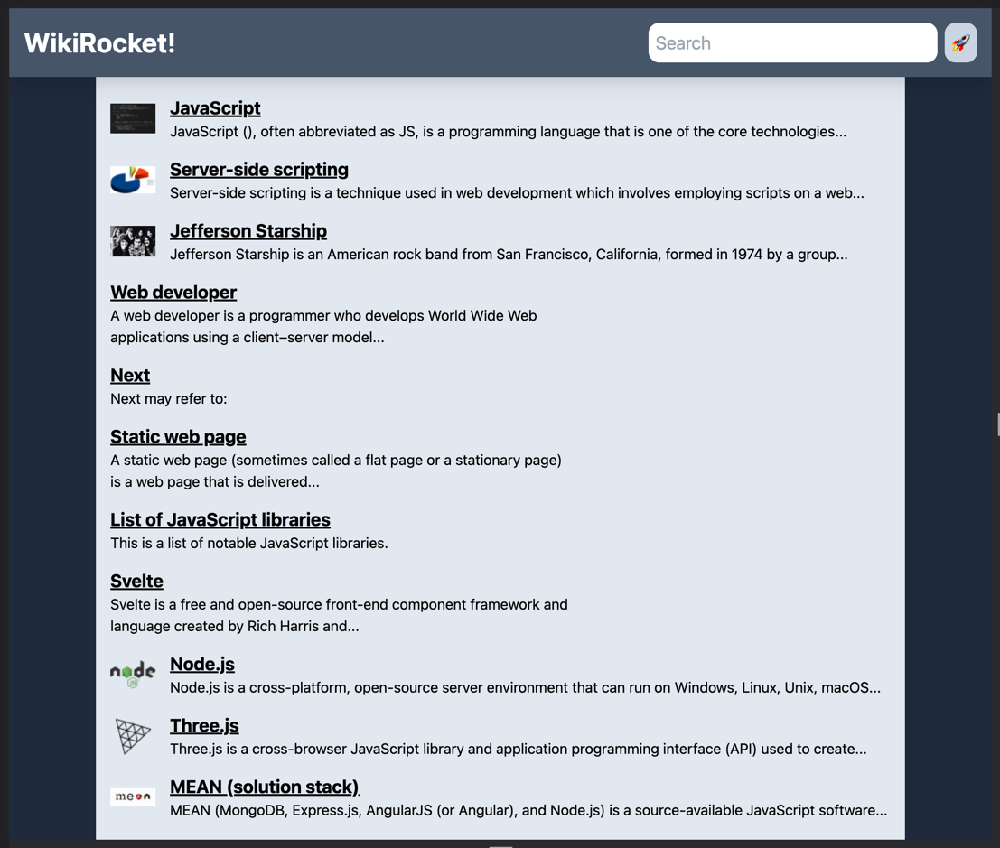

# WikiRocket App

#### Preview: [WikiRocket live at Vercel](https://nextjs-wikirocket-lake.vercel.app/)
App that uses Wikipedia API to search results in Wikipedia. Made when studying Next.js framework.

### TechStack used: 
- React
- Tailwind CSS
- Next.js
- hosted on Vercel


### Getting Started

First, run the development server:

```bash
npm run dev
# or
yarn dev
# or
pnpm dev
```

Open [http://localhost:3000](http://localhost:3000) with your browser to see the result.
<br/>
<br/>
####  More project can be found at my personal portfolio page: [www.michal-stepien.com](www.michal-stepien.com)